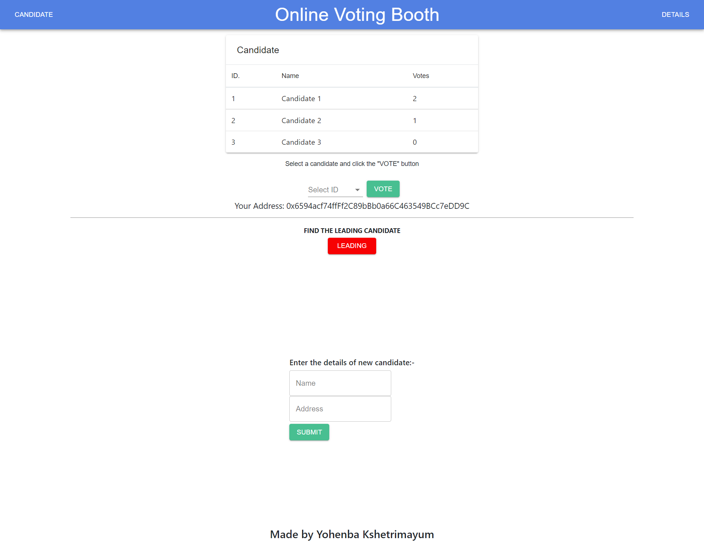

## For Truffle configured application checkout the "newbranch" above 

# Election Dapp

Election nowadays happens using Electronic voting machine(EVM) whcih can face frauds

Bringing blockchain into voting will help remove these frauds and make voting more open for all to actually see the number of votes without knowing the voters

# Made using:-

1. Reactjs 
2. Etherium 
3. Solidity
4. Web3

# Features of this application:-

1. Owner of the contract can register candidates with there name and address
2. Voters can vote for the candidate using there addresses
3. A voter can give vote only once
4. Leading candidates details can be viewed

# App Screenshot

# Setting up Metamask
1. Download metamask extenstion from https://metamask.io/
2. After installation, it'll take you to a window to set a password. Select the option to import wallet from seed phrase and set a password.
3. Use the mnemonic from the ganache instance.
4. A localhost blockchain would be added in the list of networks. Change the port number to 7545. Set the chain id as 1337.
5. Then you'll see, metamask will ask your permission to connect all the 10 accounts to the webapp.
6. Initially only the first account would be connected. Click on add account, then the second account would be added, then third and so on.

